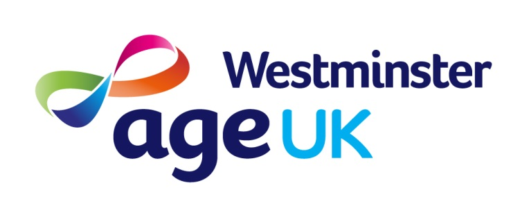

<!-- LOGO -->
<div align="center">
  <a href="https://github.com/ageukwestminster/aukw">
    
  </a>

<h3 align="center">AUKW Finance App</h3>

  <p align="center">
    project_description
    <br />
    <a href="https://github.com/ageukwestminster/aukw"><strong>Explore the docs »</strong></a>
    <br />
    <br />
    <a href="https://github.com/ageukwestminster/aukw/issues/new?labels=bug&template=bug-report---.md">Report Bug</a>
    ·
    <a href="https://github.com/ageukwestminster/aukw/issues/new?labels=enhancement&template=feature-request---.md">Request Feature</a>
  </p>
</div>


<!-- ABOUT THE PROJECT -->
## About The Project


Here's a blank template to get started. To avoid retyping too much info, do a search and replace with your text editor for the following: `ageukwestminster`, `aukw`, `twitter_handle`, `linkedin_username`, `ageukwestminster.org.uk`, `email`, `project_title`, `project_description`, `project_license`

<p align="right">(<a href="#readme-top">back to top</a>)</p>


<!-- GETTING STARTED -->
## Getting Started

This is an example of how you may give instructions on setting up your project locally.
To get a local copy up and running follow these simple example steps.

### Prerequisites

This is an example of how to list things you need to use the software and how to install them.
* npm
  ```sh
  npm install npm@latest -g
  ```

### Installation

1. Get a free API Key at [https://example.com](https://example.com)
2. Clone the repo
   ```sh
   git clone https://github.com/ageukwestminster/aukw.git
   ```
3. Install NPM packages
   ```sh
   npm install
   ```
4. Enter your API in `config.js`
   ```js
   const API_KEY = 'ENTER YOUR API';
   ```
5. Change git remote url to avoid accidental pushes to base project
   ```sh
   git remote set-url origin ageukwestminster/aukw
   git remote -v # confirm the changes
   ```
[![Product Name Screen Shot][product-screenshot]](https://aukw.org.uk)

<p align="right">(<a href="#readme-top">back to top</a>)</p>


<!-- LICENSE -->
## License

Distributed under the project_license. See `LICENSE.txt` for more information.

<p align="right">(<a href="#readme-top">back to top</a>)</p>


### Built With

* [![PHP][Php.net]][Php-url]
* [![Angular][Angular.io]][Angular-url]
* [![Bootstrap][Bootstrap.com]][Bootstrap-url]
* [![QuickBooks][QuickBooks-logo]][QuickBooks-url]
* [![FontAwesome][FontAwesome-logo]][FontAwesome-url]
* [![MariaDB][MariaDB-logo]][MariaDB-url]

<p align="right">(<a href="#readme-top">back to top</a>)</p>


<!-- CONTACT -->
## Contact

Your Name - neil.carthy@ageukwestminster.org.uk

Project Link: [https://github.com/ageukwestminster/aukw](https://github.com/ageukwestminster/aukw)

<p align="right">(<a href="#readme-top">back to top</a>)</p>


<!-- MARKDOWN LINKS & IMAGES -->
<!-- https://www.markdownguide.org/basic-syntax/#reference-style-links -->
[contributors-shield]: https://img.shields.io/github/contributors/ageukwestminster/aukw.svg?style=for-the-badge
[contributors-url]: https://github.com/ageukwestminster/aukw/graphs/contributors
[forks-shield]: https://img.shields.io/github/forks/ageukwestminster/aukw.svg?style=for-the-badge
[forks-url]: https://github.com/ageukwestminster/aukw/network/members
[stars-shield]: https://img.shields.io/github/stars/ageukwestminster/aukw.svg?style=for-the-badge
[stars-url]: https://github.com/ageukwestminster/aukw/stargazers
[issues-shield]: https://img.shields.io/github/issues/ageukwestminster/aukw.svg?style=for-the-badge
[issues-url]: https://github.com/ageukwestminster/aukw/issues
[license-shield]: https://img.shields.io/github/license/ageukwestminster/aukw.svg?style=for-the-badge
[license-url]: https://github.com/ageukwestminster/aukw/blob/master/LICENSE.txt
[linkedin-shield]: https://img.shields.io/badge/-LinkedIn-black.svg?style=for-the-badge&logo=linkedin&colorB=555
[linkedin-url]: https://linkedin.com/in/linkedin_username
[product-screenshot]: aukw-shop/src/assets/images/Frontpage.png
[Angular.io]: https://img.shields.io/badge/Angular-DD0031?style=for-the-badge&logo=angular&logoColor=white
[Angular-url]: https://angular.io/
[Bootstrap.com]: https://img.shields.io/badge/Bootstrap-563D7C?style=for-the-badge&logo=bootstrap&logoColor=white
[Bootstrap-url]: https://getbootstrap.com
[Php.net]: https://img.shields.io/badge/PHP-777BB4?&style=for-the-badge&logo=php&logoColor=white
[Php-url]: https://www.php.net/
[QuickBooks-logo]: https://img.shields.io/badge/Quickbooks-2CA01C?style=for-the-badge&logo=quickbooks&logoColor=white
[QuickBooks-url]: https://quickbooks.intuit.com/
[FontAwesome-logo]: https://img.shields.io/badge/Fontawesome-538DD7?style=for-the-badge&&logo=fontawesome&logoColor=white
[FontAwesome-url]: https://fontawesome.com/
[MariaDB-logo]: https://img.shields.io/badge/MariaDB-003545?style=for-the-badge&logo=mariadb&logoColor=white
[MariaDB-url]: https://mariadb.org/
