  
<strong>Interaction Diagram by <a href="https://bito.ai#sequence_diagram">Bito</a></strong>

```mermaid
sequenceDiagram
participant CLIENT as Client Application
participant AUTH as auth.php<br/>🔄 Updated | ●○○ Low
participant REFRESH as refresh.php<br/>🔄 Updated | ●○○ Low
participant REVOKE as revoke.php<br/>🔄 Updated | ●○○ Low
participant USER as User Model
participant JWT as JWTWrapper Model
participant DB as Database
participant COMPOSER as composer.json<br/>🔄 Updated | ●○○ Low
CLIENT->>AUTH: POST /auth (login credentials)
AUTH->>USER: Validate username/password
USER->>DB: Query user credentials
DB-->>USER: Return user data
USER-->>AUTH: Authentication result
AUTH->>JWT: Generate access/refresh tokens
JWT-->>AUTH: Return token pair
AUTH-->>CLIENT: JSON response with tokens
CLIENT->>REFRESH: GET /auth/refresh
REFRESH->>JWT: Validate refresh token
JWT-->>CLIENT: New access token
```

---

**Critical path:** Client Application-&gt;auth.php-&gt;User Model-&gt;Database-&gt;JWTWrapper Model
